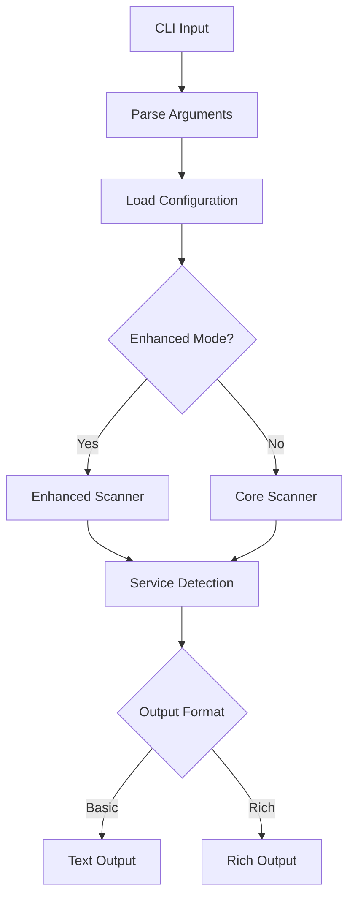
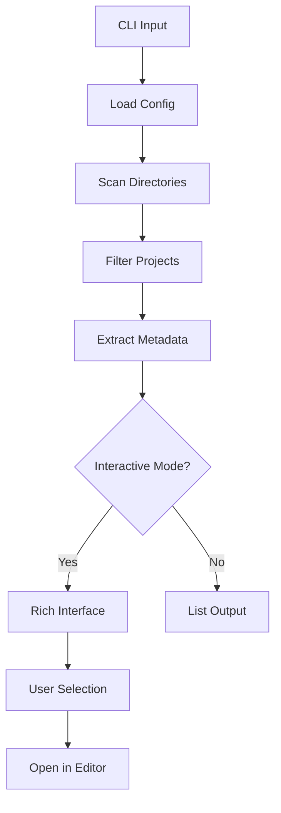

# 🏗️ IntermCLI Architecture

## Overview

IntermCLI is designed as a modular, extensible collection of interactive terminal utilities following the principle of "progressive enhancement" - core functionality works with Python standard library, with optional dependencies providing enhanced features.

## 📁 Project Structure

```
intermcli/
├── README.md                  # Project overview, quick start
├── LICENSE                    # GPL v3
├── CHANGELOG.md              # Version history
├── requirements.txt          # Optional dependencies
├── requirements-dev.txt      # Development dependencies
├── install.sh               # Installation script
├── .gitignore
├── .github/                 # GitHub-specific files
│   ├── ISSUE_TEMPLATE/
│   │   ├── bug_report.md
│   │   └── feature_request.md
│   ├── PULL_REQUEST_TEMPLATE.md
│   └── workflows/           # GitHub Actions (if used)
├── docs/                    # Documentation home
│   ├── DESIGN.md           # Design goals document
│   ├── CONTRIBUTING.md     # How to contribute
│   ├── ARCHITECTURE.md     # This document
│   ├── CONFIGURATION.md    # Config file documentation
│   ├── commands/           # Command-specific docs
│   │   ├── port-scan.md
│   │   └── project-find.md
│   └── examples/           # Usage examples
│       ├── basic-usage.md
│       └── advanced-usage.md
├── bin/                    # Executable entry points
│   └── interm             # Main CLI entry point
├── lib/                    # Library code
│   ├── core/              # Core functionality (stdlib only)
│   │   ├── __init__.py
│   │   ├── scanner.py     # Port scanning core
│   │   ├── finder.py      # Project discovery core
│   │   ├── config.py      # Configuration management
│   │   └── utils.py       # Common utilities
│   ├── enhanced/          # Enhanced features (optional deps)
│   │   ├── __init__.py
│   │   ├── http_detect.py # Enhanced HTTP detection
│   │   ├── rich_output.py # Rich terminal formatting
│   │   └── interactive.py # Interactive components
│   └── utils/             # Shared utilities
│       ├── __init__.py
│       ├── network.py     # Network utilities
│       ├── filesystem.py  # File system helpers
│       └── terminal.py    # Terminal interaction
├── config/                # Configuration files
│   ├── defaults.json      # Default configuration
│   ├── ports.json         # Port definitions
│   └── README.md         # Config documentation
├── tests/                 # Test files
│   ├── __init__.py
│   ├── test_core.py       # Core functionality tests
│   ├── test_enhanced.py   # Enhanced features tests
│   ├── test_integration.py # Integration tests
│   └── fixtures/          # Test data
└── examples/             # Example scripts and usage
    ├── sample-configs/   # Example configurations
    └── scripts/          # Example usage scripts
```

## 🎯 Core Architecture Principles

### 1. Progressive Enhancement

The architecture follows a layered approach where each layer provides progressively enhanced functionality:

```
┌─────────────────────────────────────┐
│        User Interface Layer        │  ← Interactive CLI, Rich output
├─────────────────────────────────────┤
│       Enhanced Features Layer      │  ← requests, rich, click
├─────────────────────────────────────┤
│         Core Library Layer         │  ← Python stdlib only
├─────────────────────────────────────┤
│       Configuration Layer          │  ← JSON configs, user prefs
└─────────────────────────────────────┘
```

### 2. Dependency Management

**Required Dependencies:**
- Python 3.6+
- Standard library only for core functionality

**Optional Dependencies:**
- `requests` - Enhanced HTTP service detection
- `urllib3` - Better HTTP handling and SSL
- `rich` - Enhanced terminal formatting
- `click` - Advanced CLI parsing and interaction

**Fallback Strategy:**
- All features gracefully degrade when optional dependencies are missing
- Clear feedback about available/missing capabilities
- Core functionality always available

### 3. Modular Design

Each module has a single responsibility and clear interfaces:

```python
# Example module structure
lib/
├── core/
│   ├── scanner.py     # Port scanning logic
│   ├── finder.py      # Project discovery
│   └── config.py      # Configuration management
├── enhanced/
│   ├── http_detect.py # Enhanced HTTP detection
│   └── rich_output.py # Rich terminal output
└── utils/
    ├── network.py     # Network utilities
    └── terminal.py    # Terminal helpers
```

## 🔧 Core Components

### Configuration System

**File Hierarchy:**
1. System defaults (`config/defaults.json`)
2. User global config (`~/.config/intermcli/config.json`)
3. Project local config (`.intermcli.json`)
4. Command line arguments

**Configuration Loading:**
```python
# lib/core/config.py
class ConfigManager:
    def __init__(self):
        self.config = self._load_hierarchical_config()
    
    def _load_hierarchical_config(self):
        # Load and merge configs in priority order
        pass
    
    def get(self, key, default=None):
        # Get config value with fallback
        pass
```

### Port Scanner Architecture

**Core Scanner (`lib/core/scanner.py`):**
- Basic port connectivity checking
- Simple service detection via banner grabbing
- Uses only Python standard library (`socket`, `threading`)

**Enhanced Scanner (`lib/enhanced/http_detect.py`):**
- HTTP/HTTPS service detection with `requests`
- SSL certificate analysis
- Advanced service fingerprinting
- Framework detection (Django, Flask, React, etc.)

**Service Detection Pipeline:**
```python
def detect_service(host, port, timeout=3):
    # 1. Basic connectivity check
    if not check_port_open(host, port, timeout):
        return None
    
    # 2. Protocol-specific detection
    if port in HTTP_PORTS:
        return detect_http_service(host, port)
    elif port == 22:
        return detect_ssh_service(host, port)
    elif port in DATABASE_PORTS:
        return detect_database_service(host, port)
    
    # 3. Generic banner grabbing
    return detect_generic_service(host, port)
```

### Project Finder Architecture

**Core Finder (`lib/core/finder.py`):**
- Git repository discovery
- Basic project type detection
- File system traversal with configurable patterns

**Enhanced Finder (`lib/enhanced/interactive.py`):**
- Interactive navigation with `rich`
- Fuzzy search capabilities
- Advanced project metadata extraction

**Project Discovery Pipeline:**
```python
class ProjectFinder:
    def __init__(self, config):
        self.config = config
        self.search_paths = config.get('search_paths', [])
    
    def discover_projects(self):
        # 1. Scan configured directories
        # 2. Filter by project patterns (.git, package.json, etc.)
        # 3. Extract metadata (language, last modified, etc.)
        # 4. Return structured project list
        pass
```

## 🎨 User Interface Layer

### Command Line Interface

**Main Entry Point (`bin/interm`):**
```bash
#!/bin/bash
# Route to appropriate Python module based on command
SCRIPT_DIR="$(cd "$(dirname "${BASH_SOURCE[0]}")" && pwd)"
exec python3 -m intermcli.cli "$@"
```

**CLI Structure:**
```python
# lib/cli.py (main CLI dispatcher)
import argparse
from .core import scanner, finder
from .enhanced import rich_output

def main():
    parser = argparse.ArgumentParser(prog='interm')
    subparsers = parser.add_subparsers(dest='command')
    
    # Port scanner command
    scan_parser = subparsers.add_parser('scan')
    scan_parser.add_argument('host', default='localhost')
    
    # Project finder command  
    find_parser = subparsers.add_parser('find')
    
    args = parser.parse_args()
    
    if args.command == 'scan':
        run_port_scanner(args)
    elif args.command == 'find':
        run_project_finder(args)
```

### Output Formatting

**Basic Output (`lib/core/output.py`):**
```python
def format_port_result(port, service, status):
    icon = "✅" if status == "open" else "❌"
    return f"Port {port:5} | {service:20} | {icon} {status.upper()}"

def format_project_list(projects):
    for project in projects:
        print(f"📁 {project['name']} - {project['path']}")
```

**Enhanced Output (`lib/enhanced/rich_output.py`):**
```python
from rich.console import Console
from rich.table import Table
from rich.panel import Panel

class RichFormatter:
    def __init__(self):
        self.console = Console()
    
    def format_port_results(self, results):
        table = Table(title="Port Scan Results")
        table.add_column("Port", style="cyan")
        table.add_column("Service", style="magenta")
        table.add_column("Status", style="green")
        
        for result in results:
            table.add_row(str(result.port), result.service, result.status)
        
        self.console.print(table)
```

## 🔌 Plugin Architecture (Future)

### Plugin Interface

```python
# lib/core/plugin.py
class PluginInterface:
    def __init__(self, config):
        self.config = config
    
    def get_name(self):
        """Return plugin name"""
        raise NotImplementedError
    
    def get_commands(self):
        """Return list of commands this plugin provides"""
        raise NotImplementedError
    
    def execute(self, command, args):
        """Execute plugin command"""
        raise NotImplementedError

class PluginManager:
    def __init__(self):
        self.plugins = []
    
    def discover_plugins(self):
        # Scan for plugins in standard locations
        pass
    
    def load_plugin(self, plugin_path):
        # Load and register plugin
        pass
```

### Plugin Discovery

**Plugin Locations:**
1. `~/.config/intermcli/plugins/`
2. `/usr/local/share/intermcli/plugins/`
3. `./plugins/` (project-local)

## 🔄 Data Flow

### Port Scanner Flow



### Project Finder Flow



## 🧪 Testing Strategy

### Test Structure

```python
# tests/test_core.py
class TestPortScanner:
    def test_basic_port_check(self):
        # Test core port checking functionality
        pass
    
    def test_service_detection_fallback(self):
        # Test that service detection works without optional deps
        pass

# tests/test_enhanced.py  
class TestEnhancedFeatures:
    def test_http_detection_with_requests(self):
        # Test enhanced HTTP detection
        pass
    
    def test_rich_output_formatting(self):
        # Test rich output formatting
        pass

# tests/test_integration.py
class TestIntegration:
    def test_full_port_scan_workflow(self):
        # Test complete port scanning workflow
        pass
    
    def test_project_finder_workflow(self):
        # Test complete project finding workflow
        pass
```

### Testing Matrix

| Component | Basic Tests | Enhanced Tests | Integration Tests |
|-----------|-------------|----------------|-------------------|
| Port Scanner | ✅ Core connectivity | ✅ HTTP detection | ✅ Full workflow |
| Project Finder | ✅ Git discovery | ✅ Interactive UI | ✅ Editor integration |
| Configuration | ✅ File loading | ✅ User preferences | ✅ Override hierarchy |
| Output | ✅ Text formatting | ✅ Rich formatting | ✅ Terminal compatibility |

## 🚀 Deployment & Distribution

### Installation Methods

1. **Direct Install:** `./install.sh`
2. **Package Managers:** Future pip/homebrew packages
3. **Container:** Future Docker image for isolated usage

### Configuration Management

**System Integration:**
- Shell completion scripts
- Man pages generation
- Desktop integration (future)

**User Data:**
- Config directory: `~/.config/intermcli/`
- Cache directory: `~/.cache/intermcli/`
- Data directory: `~/.local/share/intermcli/`

## 🔐 Security Considerations

### Network Scanning
- Respect rate limits and timeouts
- Provide clear feedback about scanning activities
- Allow configuration of scan intensity

### File System Access
- Limit search to configured directories
- Respect `.gitignore` and permission boundaries
- Secure handling of file paths and user input

### Configuration Security
- Validate configuration file contents
- Sanitize user-provided paths and commands
- Clear separation between trusted and untrusted input

## 📈 Performance Considerations

### Scalability
- Concurrent scanning with configurable thread pools
- Efficient file system traversal with early termination
- Caching of expensive operations (project discovery)

### Memory Management
- Streaming processing for large result sets
- Configurable result limits
- Efficient data structures for common operations

### Startup Performance
- Lazy loading of optional dependencies
- Fast-path for common operations
- Minimal import overhead for core functionality

## 🔮 Future Architecture Enhancements

### Planned Features
1. **Plugin System** - Third-party command extensions
2. **Configuration UI** - Interactive configuration wizard
3. **Remote Scanning** - Distributed scanning capabilities
4. **Result Caching** - Persistent result storage
5. **Integration APIs** - RESTful API for tool integration

### Architectural Evolution
- Migration to async/await for I/O operations
- GraphQL API for complex queries
- WebUI for remote management
- Integration with monitoring systems

---

This architecture supports the design goals of being interactive, terminal-native, and progressively enhanced while maintaining clean separation of concerns and extensibility for future enhancements.